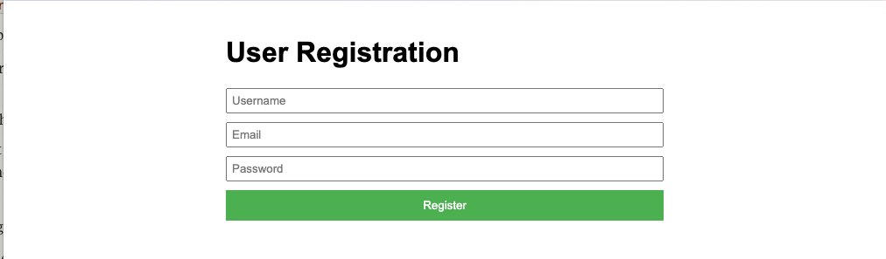
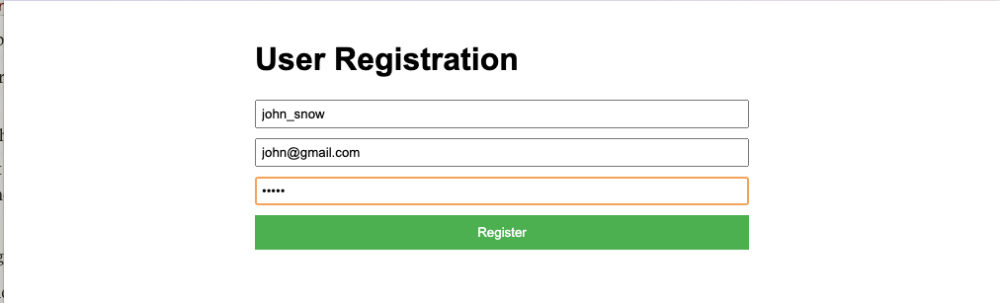
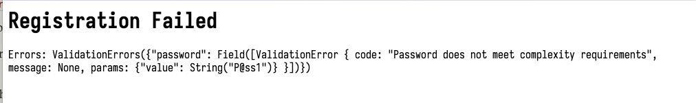
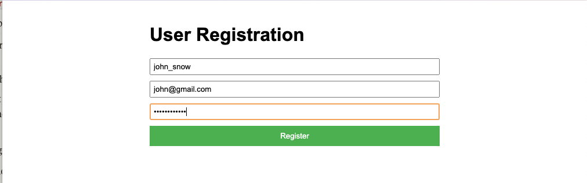
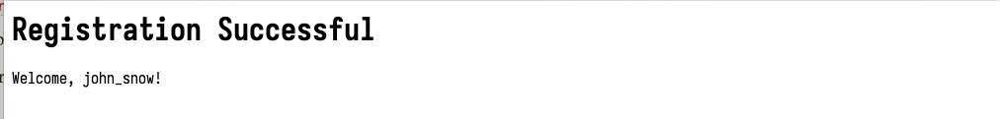
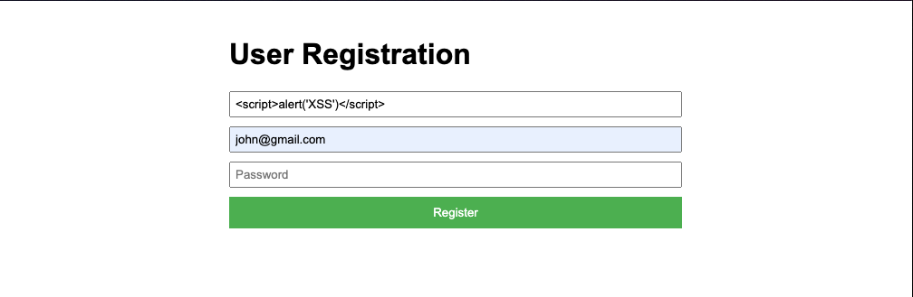
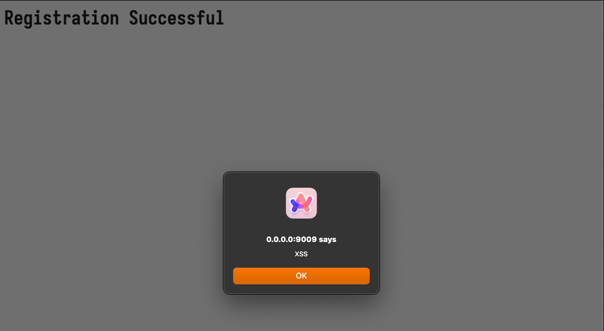

# Securing Your Fintech Backend: Mastering Input Validation with Rust

Welcome to the second article in our "Mastering Backend Security with Rust" series. 
In this installment, we'll dive deep into input validation, a core security measure 
for any backend application, especially in the fintech sector.

We picked a fintech application as our sample application because it's a prime target for hackers, a good candidate for 
a series of articles on security, and it is also a popular niche of web applications in Nigeria.

## Our Sample Application: RustPay

For this series, we're building RustPay, a simple peer-to-peer payment system. 
Users can create accounts, send money to each other, and view their transaction history. 
This application provides an excellent context for implementing robust security measures.

## Why Input Validation Matters

Input validation is your first line of defense against a wide array of attacks, including:

1. SQL Injection
2. Cross-Site Scripting (XSS)
3. Buffer Overflow
4. Command Injection

In a fintech application like RustPay, invalid input could lead to unauthorized transactions, 
data breaches, or system compromises. Proper input validation helps ensure that only valid, expected data enters your system.

## Implementing Input Validation in Rust

Let's look at how we can implement input validation for RustPay using Rust. 
We'll focus on validating user registration data and transaction details.

### User Registration Validation

First, let's define our User struct and implement validation for it:

```rust
use validator::{Validate, ValidationError};

#[derive(Validate)]
struct User {
    #[validate(length(min = 3, max = 50))]
    username: String,
    #[validate(email)]
    email: String,
    #[validate(custom(function = "validate_password"))]
    password: String,
}

fn validate_password(password: &str) -> Result<(), ValidationError> {
    let has_uppercase = password.chars().any(|c| c.is_uppercase());
    let has_lowercase = password.chars().any(|c| c.is_lowercase());
    let has_digit = password.chars().any(|c| c.is_digit(10));
    let has_special = password.chars().any(|c| r#"!@#$%^&*(),.?":{}|<>"#.contains(c));
    let is_long_enough = password.len() >= 10;

    if has_uppercase && has_lowercase && has_digit && has_special && is_long_enough {
        Ok(())
    } else {
        Err(ValidationError::new("Password does not meet complexity requirements"))
    }
}
```

We will now write test cases for the above code, to be sure that our user's input is validated properly.
```shell
cargo test
   Compiling rust-pay v0.1.0 (/Users/.../rust-pay)
    Finished test [unoptimized + debuginfo] target(s) in 0.71s
     Running unittests src/main.rs (target/debug/deps/rust_pay-bf4431fe195e7f4f)

running 9 tests
test tests::test_invalid_email_format ... ok
test tests::test_invalid_username_too_long ... ok
test tests::test_invalid_password_no_digit ... ok
test tests::test_invalid_password_no_lowercase ... ok
test tests::test_invalid_password_no_special_character ... ok
test tests::test_invalid_password_too_short ... ok
test tests::test_invalid_password_no_uppercase ... ok
test tests::test_valid_user ... ok
test tests::test_invalid_username_too_short ... ok

test result: ok. 9 passed; 0 failed; 0 ignored; 0 measured; 0 filtered out; finished in 0.01s
```
To check our error logs, we can add a `main` function with different cases in it:
```rust
fn main() {
    let user = User {
        username: "validuser".to_string(),
        email: "user@example.com".to_string(),
        password: "P@ssw0rd123!".to_string(),
    };

    match user.validate() {
        Ok(_) => println!("User is valid and ready for registration."),
        Err(e) => println!("User validation failed: {:?}", e),
    }

    // Simulating invalid user data
    let invalid_user = User {
        username: "ab".to_string(), // Too short
        email: "invalid-email".to_string(), // Invalid email format
        password: "weakpassword".to_string(), // Does not meet password complexity
    };

    match invalid_user.validate() {
        Ok(_) => println!("Invalid user is somehow valid (this should not happen)."),
        Err(e) => println!("Invalid user validation correctly failed: {:?}", e),
    }
}
```
Running it, we get:
```shell
cargo run
   Compiling rust-pay v0.1.0 (/Users/macbobbychibuzor/Engineering/Gigs/rust-pay)
    Finished dev [unoptimized + debuginfo] target(s) in 0.69s
     Running `target/debug/rust-pay`
User is valid and ready for registration.
Invalid user validation correctly failed: ValidationErrors({"password": Field([ValidationError { code: "Password does not meet complexity requirements", message: None, params: {"value": String("weakpassword")} }]), "email": Field([ValidationError { code: "email", message: None, params: {"value": String("invalid-email")} }]), "username": Field([ValidationError { code: "length", message: None, params: {"value": String("ab"), "min": Number(3), "max": Number(50)} }])})
```

And if we want to see it on a web application, we can use a library like `axum` to handle the HTTP requests and
responses. For simplicity, we will skip using a database.

We will create a registration endpoint `/` that serves an HTML form for user registration. The registration form
will look like this:

```rust
async fn register_form() -> Html<&'static str> {
    Html(
        r#"
        <!DOCTYPE html>
        <html>
        <head>
            <title>User Registration</title>
            <style>
                body { font-family: Arial, sans-serif; max-width: 500px; margin: 0 auto; padding: 20px; }
                form { display: flex; flex-direction: column; }
                input { margin-bottom: 10px; padding: 5px; }
                button { padding: 10px; background-color: #4CAF50; color: white; border: none; cursor: pointer; }
                button:hover { background-color: #45a049; }
            </style>
        </head>
        <body>
            <h1>User Registration</h1>
            <form action="/register" method="post">
                <input type="text" name="username" placeholder="Username" required>
                <input type="email" name="email" placeholder="Email" required>
                <input type="password" name="password" placeholder="Password" required>
                <button type="submit">Register</button>
            </form>
        </body>
        </html>
        "#
    )
}
```


Next, we will create an endpoint `/register` that handles POST requests for user registration,
validating the input using our `User` struct and `validate_password` function:
```rust
async fn register_user(Form(user): Form<User>) -> (StatusCode, Html<String>) {
    match user.validate() {
        Ok(_) => (
            StatusCode::OK,
            Html(format!("<h1>Registration Successful</h1><p>Welcome, {}!</p>", user.username))
        ),
        Err(e) => (
            StatusCode::BAD_REQUEST,
            Html(format!("<h1>Registration Failed</h1><p>Errors: {:?}</p>", e))
        ),
    }
}
```

Finally, we will create a server that runs on `0.0.0.0:9009` or any other port, to serve our HTML form and handle the
registration endpoint:
```rust
#[tokio::main]
async fn main() {
    let app = Router::new()
        .route("/", get(register_form))
        .route("/register", post(register_user));

    let addr = SocketAddr::from(([0, 0, 0, 0], 9009));
    println!("Server running on http://{}", addr);

    axum::serve(tokio::net::TcpListener::bind(addr).await.unwrap(), app).await.unwrap();
}
```
On the web app, let's try to register a user with invalid data (e.g., short password):

This should result in an error message indicating the validation failure:


Next, let's register a user using valid data:

This should result in a success message indicating the registration was successful:


In this example, we used the `validator` crate to define validation rules declaratively. 
We set length constraints for the username, ensured the email is in a valid format, 
and created a custom validator for password complexity.

How about transactions on our app? Let's see how we can validate transactions on our app.

### Transaction Validation

Another form of input that needs validation is transactions. Transactions are the core of any financial application,
and backend engineers are responsible for ensuring that transactions are valid before they are processed.
Some backend systems prevent any form of user input during the transaction process, but there are
some cases where user input is actually collected during the transaction process.

Now, let's implement validation for our transaction struct:

```rust
use axum::{
    routing::{get, post},
    Router,
    response::{Html, IntoResponse},
    extract::{Form, State},
    http::StatusCode,
};
use dashmap::DashMap;
use serde::Deserialize;
use std::net::SocketAddr;
use std::sync::Arc;
use validator::{Validate, ValidationError, ValidationErrors, ValidationErrorsKind};
use rust_decimal::Decimal;
use uuid::Uuid;

#[derive(Debug, Deserialize, Validate)]
struct Transaction {
    #[validate(custom(function = "validate_uuid"))]
    from_user_id: String,
    #[validate(custom(function = "validate_uuid"))]
    to_user_id: String,
    #[validate(custom(function = "validate_amount"))]
    amount: Decimal,
    #[validate(length(max = 200))]
    description: Option<String>,
}

fn validate_amount(amount: &Decimal) -> Result<(), ValidationError> {
    if *amount >= Decimal::new(1, 2) && *amount <= Decimal::new(1_000_000, 0) {
        Ok(())
    } else {
        Err(ValidationError::new("Amount must be between 0.01 and 1,000,000.00"))
    }
}

fn validate_uuid(uuid: &str) -> Result<(), ValidationError> {
    match Uuid::parse_str(uuid) {
        Ok(_) => Ok(()),
        Err(_) => Err(ValidationError::new("Invalid UUID")),
    }
}
```

In this implementation:

1. We use `Uuid` to ensure that user IDs are valid UUIDs.
2. The transaction amount is limited between 0.01 and 1,000,000.00. This range can be adjusted based on your specific business rules.
3. We allow an optional description with a maximum length of 200 characters.

Now, let's add some real-world validation logic. We will use the `dashmap` crate to build a database
for ease, instead of running a PostgreSQL database externally.
```rust
#[derive(Clone)]
struct Database {
    balances: Arc<DashMap<String, Decimal>>,
    daily_totals: Arc<DashMap<String, Decimal>>,
}

impl Database {
    fn new() -> Self {
        Self {
            balances: Arc::new(DashMap::new()),
            daily_totals: Arc::new(DashMap::new()),
        }
    }

    async fn get_user_balance(&self, user_id: &str) -> Result<Decimal, ValidationError> {
        self.balances.get(user_id)
            .map(|balance| *balance)
            .ok_or_else(|| ValidationError::new("User not found"))
    }

    async fn get_user_daily_transaction_total(&self, user_id: &str) -> Result<Decimal, ValidationError> {
        Ok(*self.daily_totals.entry(user_id.to_string()).or_insert(Decimal::new(0, 0)))
    }

    async fn update_balance(&self, user_id: &str, amount: Decimal) {
        self.balances.entry(user_id.to_string())
            .and_modify(|balance| *balance += amount)
            .or_insert(amount);
    }

    async fn update_daily_total(&self, user_id: &str, amount: Decimal) {
        self.daily_totals.entry(user_id.to_string())
            .and_modify(|total| *total += amount)
            .or_insert(amount);
    }
}
```

Now, we will implement specific methods for the `Transaction` struct, such as 
the `validate_balance` and `validate_daily_limit` methods to validate the transaction:
```rust
impl Transaction {
    async fn validate_balance(&self, db: &Database) -> Result<(), ValidationError> {
        let balance = db.get_user_balance(&self.from_user_id).await?;
        if balance < self.amount {
            return Err(ValidationError::new("Insufficient funds"));
        }
        Ok(())
    }

    async fn validate_daily_limit(&self, db: &Database) -> Result<(), ValidationError> {
        let daily_total = db.get_user_daily_transaction_total(&self.from_user_id).await?;
        if daily_total + self.amount > Decimal::new(50000, 0) { // 50,000 daily limit
            return Err(ValidationError::new("Daily transaction limit exceeded"));
        }
        Ok(())
    }

    async fn validate_transaction(&self, db: &Database) -> Result<(), ValidationErrors> {
        let mut errors = ValidationErrors::new();

        if let Err(e) = self.validate() {
            for (field, error_kind) in e.into_errors() {
                match error_kind {
                    ValidationErrorsKind::Field(field_errors) => {
                        for error in field_errors {
                            errors.add(field, error);
                        }
                    },
                    ValidationErrorsKind::Struct(_) => {}, // Ignore struct errors for now
                    ValidationErrorsKind::List(_) => {}, // Ignore list errors for now
                }
            }
        }

        if let Err(e) = self.validate_balance(db).await {
            errors.add("amount", e);
        }

        if let Err(e) = self.validate_daily_limit(db).await {
            errors.add("amount", e);
        }

        if self.from_user_id == self.to_user_id {
            errors.add("to_user_id", ValidationError::new("Cannot transfer to the same account"));
        }

        if errors.is_empty() {
            Ok(())
        } else {
            Err(errors)
        }
    }

    async fn process(&self, db: &Database) -> Result<(), ValidationError> {
        db.update_balance(&self.from_user_id, -self.amount).await;
        db.update_balance(&self.to_user_id, self.amount).await;
        db.update_daily_total(&self.from_user_id, self.amount).await;
        Ok(())
    }
}
```

We also added a `validate_transaction` method to validate the transaction before processing it, and a
`process` method to actually process the transaction. Let's create the HTML form for the transaction
operations:
```rust
async fn transaction_form() -> Html<&'static str> {
    Html(
        r#"
        <!DOCTYPE html>
        <html>
        <head>
            <title>RustPay - New Transaction</title>
            <style>
                body { font-family: Arial, sans-serif; max-width: 500px; margin: 0 auto; padding: 20px; }
                form { display: flex; flex-direction: column; }
                input, select { margin-bottom: 10px; padding: 5px; }
                button { padding: 10px; background-color: #4CAF50; color: white; border: none; cursor: pointer; }
                button:hover { background-color: #45a049; }
            </style>
        </head>
        <body>
            <h1>RustPay - New Transaction</h1>
            <form action="/transaction" method="post">
                <input type="text" name="from_user_id" placeholder="From User ID (UUID)" required>
                <input type="text" name="to_user_id" placeholder="To User ID (UUID)" required>
                <input type="number" name="amount" step="0.01" min="0.01" max="1000000" placeholder="Amount" required>
                <input type="text" name="description" placeholder="Description (optional)">
                <button type="submit">Submit Transaction</button>
            </form>
        </body>
        </html>
        "#
    )
}

async fn process_transaction(
    State(db): State<Database>,
    Form(transaction): Form<Transaction>,
) -> impl IntoResponse {
    match transaction.validate_transaction(&db).await {
        Ok(_) => {
            match transaction.process(&db).await {
                Ok(_) => (
                    StatusCode::OK,
                    Html(format!("<h1>Transaction Successful</h1><p>Amount: {}</p>", transaction.amount))
                ),
                Err(e) => (
                    StatusCode::INTERNAL_SERVER_ERROR,
                    Html(format!("<h1>Transaction Failed</h1><p>Error: {:?}</p>", e))
                ),
            }
        },
        Err(e) => (
            StatusCode::BAD_REQUEST,
            Html(format!("<h1>Transaction Failed</h1><p>Errors: {:?}</p>", e))
        ),
    }
}

async fn add_balance(State(db): State<Database>) -> (StatusCode, Html<String>) {
    let user_id = Uuid::new_v4().to_string();
    db.update_balance(&user_id, Decimal::new(100000, 0)).await; // Add 100,000 to the new account
    (StatusCode::OK, Html(format!("Added balance to new user. ID: {}", user_id)))
}
```

Finally, we'll add the routes for the transaction form and the transaction processing:
```rust
#[tokio::main]
async fn main() {
    let db = Database::new();

    let app = Router::new()
        .route("/", get(register_form))
        .route("/register", post(register_user))
        .route("/transaction", post(process_transaction))
        .route("/add_balance", get(add_balance))
        .with_state(db);

    let addr = SocketAddr::from(([0, 0, 0, 0], 9009));
    println!("Server running on http://{}", addr);

    axum::Server::bind(&addr)
        .serve(app.into_make_service())
        .await
        .unwrap();
}
```

If you notice any errors in the codes, you might need to verify your dependencies versions and features:
```toml
[dependencies]
validator = { version = "0.18.1", features = ["derive"]}
axum = "0.6.18"
serde = { version = "1.0.180", features = ["derive"] }
tokio = { version = "1.29.1", features = ["full"] }
rust_decimal = "1.36.0"
uuid = { version = "1.3", features = ["v4"] }
dashmap = "6.0.1"
```

Now, let's test the app to see how this works:

1. **Start the server:** Run your Rust application using cargo run. This will start the server on http://0.0.0.0:9009.
2. **Add balance to a user account:** Visit http://0.0.0.0:9009/add_balance in your browser. This will create a new user account with 100,000 units of currency and return the user's UUID.
3. **Attempt to make transactions:** Visit http://0.0.0.0:9009/transaction in your browser. You'll see a form where you can enter transaction details.
   - Use the UUID from step 2 (59780925-8698-4e25-b344-109b067babb3) as the "From User ID"
   - Generate a new UUID (you can use an online UUID generator or revisit the `/add_balance` endpoint to make a new user) for the "To User ID"
   - Enter an amount and optional description
   - Submit the form to process the transaction


You can test various scenarios:
- Valid transaction
- Transaction exceeding balance
- Transaction exceeding daily limit
- Invalid UUID (can be invalid account number, in the case of banking applications)
- Invalid amount
- Transferring to the same account

# Borderline attack vectors.
While we have handled some of the common attack vectors, there are still some borderline attack vectors that can
be executed on your application. For these, you may have to implement additional security measures especially
on the frontend.

For example, let's use our existing registration form at http://0.0.0.0:9009/ to try an attack of Cross-Site Scripting (XSS) attack.
Try entering this in the "Username" field:
```
<script>alert('XSS')</script>
```

When you submit the form, you'll see an alert box with the message "XSS" in it:


To mitigate this, you may try to escape or sanitize user input before rendering it in HTML. Most modern web frameworks
provide built-in mechanisms for this already. So while you implement security on your backend, you must also
ensure that a secure frontend is in place.

## Conclusion

Input validation is a critical first step in securing your fintech backend. 
By leveraging Rust's type system and third-party libraries like `validator`, we can create 
robust, easy-to-maintain validation rules that help protect our application from a wide range of potential attacks.

Remember, while input validation is crucial, it's just one part of a comprehensive security strategy. 
In our next article, we'll explore API rate limiting to further enhance the security of our RustPay application.

Stay tuned, and happy coding!

---

*This article is part of the "Mastering Backend Security with Rust" series by MasteringBackend.com. Our mission is to empower developers to become proficient in backend engineering, with a focus on building secure and efficient systems.*
